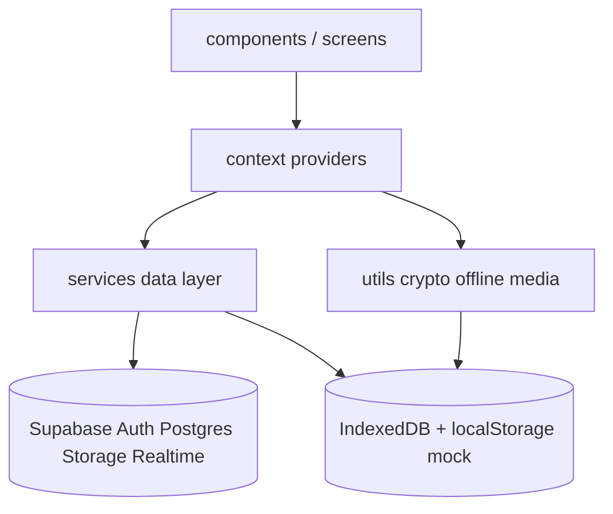
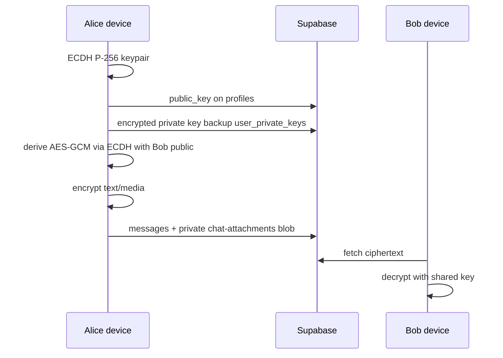

# Coiny architecture

Coiny is a cross-platform messenger client (Web / Electron / Capacitor Android) on **React 19 + Vite 8 + Supabase**.

This document reflects the post-refactor layout (phases A–E).

---

## High-level layers



| Layer | Responsibility |
|-------|----------------|
| **UI** | Presentational React components, modals, chat chrome |
| **Context** | Session, E2EE keys, chat state, WebRTC calls |
| **Services** | Auth / chat / message / media / offline queue; live vs mock |
| **Utils** | E2EE (Web Crypto), media validation, IndexedDB |
| **Backend** | Supabase RLS, RPCs, private storage, Realtime topics |

---

## Source layout

```
src/
  components/          # screens & widgets
    chat/              # ChatHeader, MessageBubble, mediaPlayers, …
    settings/          # Profile / Appearance / Stickers / E2EE tabs
  context/
    AuthContext.jsx
    E2EEContext.jsx
    ChatContext.jsx    # re-export
    chat/              # ChatProvider + hooks (loader, actions, realtime, …)
    CallContext.jsx    # re-export
    calls/             # CallProvider, signaling, media, ICE
  services/
    dataLayer.js       # facade: dataService.*
    authService.js / authEmail.ts
    chatService.js / messageService.js / mediaService.js
    offlineQueue.js / offlineQueueCore.js
  types/               # shared TS types (profile, chat, message, call)
  utils/               # e2eeHelper, mediaValidation, indexedDb, …
  mocks/               # demo sticker packs
```

Public entry points kept stable for imports:

- `context/ChatContext.jsx` → `chat/ChatProvider`
- `context/CallContext.jsx` → `calls/CallProvider`
- `services/dataLayer.js` → domain services

---

## Auth model (username-first)

UI is **username + password**. Supabase Auth still needs an email; the client builds an *internal* address:

| Scheme | Address | Use |
|--------|---------|-----|
| Modern | `{username}@coiny.users.local` | New sign-ups |
| Legacy | `{username}@tg-clone.com` | Existing accounts |

Sign-in tries modern, then legacy on invalid credentials. See `authEmail.ts` and README.

Mock mode stores `passwordHash` (SHA-256), not plaintext.

---

## E2EE flow



- **Algorithms:** ECDH P-256, AES-GCM-256, PBKDF2 600k for password backup  
- **Local:** `CryptoKey` `extractable: false` in memory / IndexedDB  
- **MITM:** Safety Numbers in `ChatInfo`  
- **Helpers:** `utils/e2eeHelper.js` (+ `.d.ts`)

---

## Messaging & offline

1. Optimistic message in UI (`useChatActions`)  
2. If offline / offline media → `createOfflineQueueItem` + IndexedDB blob  
3. On online → `processOfflineQueueItem` (optional E2EE, upload, `sendMessage`)  
4. Realtime INSERT merges server id / decrypts (`useChatRealtime`)  

Core pure queue helpers: `offlineQueueCore.js`.  
Unit tests: `tests/offlineQueue.test.mjs`.

---

## Calls (WebRTC)

- Signaling: private Realtime topics `call:chat:{id}` (+ `:media` for media channel)  
- 1:1 and group mesh in `calls/CallProvider.jsx`  
- ICE: `calls/iceServers.ts`  
- UI: `CallOverlay.jsx`  
- Live e2e: `tests/e2e/two-user-call.spec.mjs` (fake devices + remote audio feed)

---

## Data access

```text
dataService (facade)
  ├── authService
  ├── chatService
  ├── messageService
  └── mediaService
```

`dataService.isLive()` → Supabase configured; otherwise mock in `localStorage`.

---

## Platforms

| Target | Tooling | Output |
|--------|---------|--------|
| Web | Vite | `dist/`, gh-pages |
| Desktop | Electron + electron-builder | `dist-electron/` |
| Android | Capacitor 8 | `android/`, signed APK via CI |

Version single source: `package.json` → Vite `import.meta.env.APP_VERSION`.

---

## Testing map

| Kind | Command / path |
|------|----------------|
| Crypto + unit | `npm test` |
| Typecheck | `npm run typecheck` |
| Contracts | `tests/*Contracts*.test.mjs` |
| Offline queue | `tests/offlineQueue.test.mjs` |
| E2EE regression | `tests/e2eeRegression.test.mjs` |
| Live two-user | `npm run test:e2e` + `E2E_*` secrets |

Details: [live-e2e.md](./live-e2e.md).

---

## Related docs

- [RELEASING.md](./RELEASING.md) — tags, Android/Windows signing  
- [qa-security-report-2026-07-23.md](./qa-security-report-2026-07-23.md) — security QA  
- [OPS.md](./OPS.md) — residual platform / ops risks  
- [DEFINITION_OF_DONE.md](./DEFINITION_OF_DONE.md) — remediation plan DoD  
